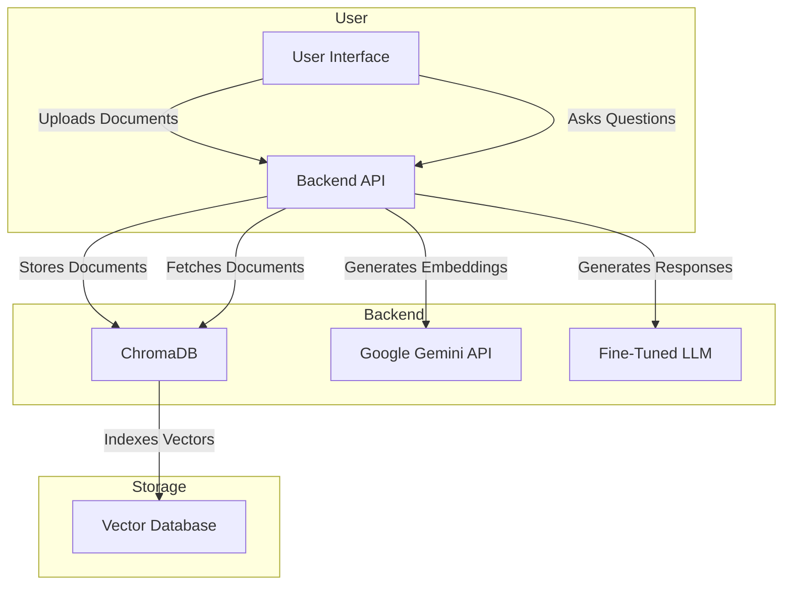
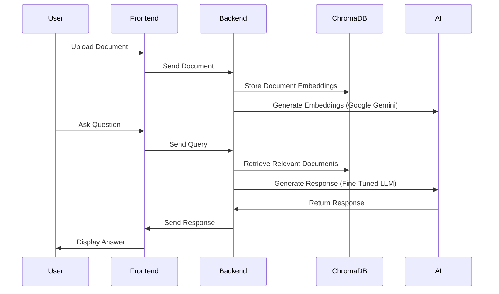

# 📖 AI-Powered Document Processing & Chatbot Service

The system allows users to upload documents, perform AI-powered searches, and receive intelligent insights. It enhances document retrieval by providing accurate, context-aware responses using fine-tuned AI models, making it easy to find relevant information quickly and efficiently.

---

## 🔹 How It Works:

✔ **Google Gemini AI** generates **vector embeddings** for document storage & retrieval.  
✔ **Fine-Tuned LLM (Mistral-7B/Phi-2)** is used for chatbot responses, ensuring **accurate and domain-specific answers**.  
✔ **Retrieval-Augmented Generation (RAG)** dynamically **retrieves relevant documents** before generating responses.

---

## 🛠 System Architecture

Below is a high-level architecture diagram of the system:



---

## 🔄 Workflow Diagram

The following diagram illustrates the workflow for document processing and chatbot interaction:



---

## 🚀 Features & Benefits

### 📖 AI-Powered Document Search (Google Gemini AI)

✅ **Smart Semantic Search** – Finds relevant documents **even without exact keyword matches**.  
✅ **Multi-Format Support** – Works with **PDF, DOCX, TXT, HTML**.  
✅ **Fast Retrieval** – Uses **ChromaDB** for vector-based document indexing.

---

### 🤖 AI Chatbot (Fine-Tuned LLM)

✅ **Fine-Tuned LLM Integration** – Trained on **custom business data** for domain-specific accuracy.  
✅ **User-Specific Responses** – Chatbot provides answers based on **retrieved documents**.  
✅ **Two AI Modes**:  
 - **Google Gemini AI**: Used for **vector embeddings & document retrieval**.  
 - **Fine-Tuned LLM**: Used for **chatbot responses with improved accuracy**.

---

### 📤 Document & Folder Management

✅ **Upload Documents** via a simple UI.  
✅ **Organize Documents** into folders.  
✅ **Custom Document Names** during upload.  
✅ **Delete & Manage** documents as needed.

---

## 🔧 Fine-Tuning on Custom Data (Mistral-7B/Phi-2)

The chatbot **uses a fine-tuned model** instead of generic AI responses to improve accuracy.  
The fine-tuning process includes:

✔ **Dataset Curation** – Preparing, cleaning, and structuring custom training data.  
✔ **Hyperparameter Optimization** – Adjusting batch size, learning rate, and training epochs.  
✔ **Efficient Training** – Using **LoRA (Low-Rank Adaptation)** to fine-tune only essential model parameters.

---

### 🔹 Retrieval-Augmented Generation (RAG)

The chatbot **retrieves documents dynamically** and generates responses **based on real-time data**, improving accuracy and relevance.

---

### 🔹 Model Distillation & Inference Optimization

✔ **Model Distillation** – Trained a **lighter version** of the model for faster responses.  
✔ **Inference Optimization** – Implemented **quantization** to reduce memory usage.  
✔ **Batch Processing & Caching** – Optimized **query efficiency**.

---

### 🔹 Use Your Own Fine-Tuned Model

- The **fine-tuning code is included** in this repo.
- You can **train a custom model**, upload it, and **replace the API key** to integrate your own fine-tuned LLM.

---

## ⚡ Quick Start Guide

### 1️⃣ Clone & Setup

```sh
# Clone the repository
git clone https://github.com/arashghezavati/Document-Vectorization-Service.git
cd Document-Vectorization-Service

# Create a virtual environment
python -m venv venv
source venv/bin/activate  # Linux/Mac
.\venv\Scripts\activate   # Windows

# Install dependencies
pip install -r python-services/requirements.txt
```

---

### 2️⃣ Configure API Keys & Fine-Tuned Model

Create a `.env` file in the root directory and add the following:

```env
GOOGLE_GEMINI_API_KEY=your_gemini_api_key
GEMINI_MODEL=gemini-2.0-flash

FINE_TUNED_LLM_API=your_fine_tuned_llm_api_endpoint
FINE_TUNED_LLM_MODEL_NAME=mistral-7B-finetuned
JWT_SECRET_KEY=your_jwt_secret_key
EMBEDDING_DIMENSION=768
EMBEDDING_MODEL=text-embedding-004
```

If you're using your own fine-tuned model, upload it and replace the API endpoint.

---

### 3️⃣ Start the AI Chatbot API

```sh
# Navigate to the python-services directory
cd python-services

# Start the FastAPI server
python run_server.py
```

📌 Backend URL: `http://localhost:8000`  
📌 API Docs: `http://localhost:8000/docs`

---

### 4️⃣ Open the Application UI

1. Open `http://localhost:3000` in your browser.
2. Register or log in to your account.
3. Navigate through the interface:
   - **Dashboard**: Overview of documents.
   - **Documents**: Upload & manage files.
   - **Chat**: Ask AI about stored business data.

---

## 🏗 Fine-Tuning Your Own Model

If you want to fine-tune a new model, follow these steps:

### 1️⃣ Prepare Training Data

Store your training data as a CSV or JSON file inside `fine-tuning/`.  
Example structure:

```json
[
  { "text": "How does Express Entry work in Canada?" },
  { "text": "Explain the steps for applying for a visa." }
]
```

---

### 2️⃣ Train a New Model

```sh
cd fine-tuning

# Install fine-tuning dependencies
pip install -r requirements.txt

# Start training (Adjust hyperparameters in fine_tune.py)
python fine_tune.py
```

The model will be saved in `fine-tuning/your-fine-tuned-model`.

---

### 3️⃣ Deploy the Fine-Tuned Model

1. Upload the model to a hosting service (Hugging Face, AWS, etc.).
2. Replace `FINE_TUNED_LLM_API` in `.env` with your API endpoint.

---

## 📚 Use Cases

### 🔹 Business Knowledge Management

✔ Store internal company documents and search instantly.  
✔ Employees can ask AI about policies, reports, and more.

---

### 🔹 Legal & Compliance

✔ Quickly retrieve legal documents, case studies, and contracts.  
✔ Get AI-powered summaries for faster decision-making.

---

### 🔹 Customer Support Automation

✔ Automate responses by searching FAQs & knowledge bases.  
✔ Reduce manual support workload.

---

## 🛠 Technical Stack

| Component      | Technology Used                    |
| -------------- | ---------------------------------- |
| **Backend**    | FastAPI, ChromaDB                  |
| **AI Models**  | Google Gemini API, Fine-Tuned LLM  |
| **Frontend**   | React.js                           |
| **Auth**       | JWT-based authentication           |
| **Storage**    | ChromaDB (Vector Database)         |
| **Processing** | PyPDF2, python-docx, BeautifulSoup |

---

## 🤝 Contributing

We welcome contributions! To contribute:

1️⃣ Fork the repository  
2️⃣ Create a feature branch (`git checkout -b feature/your-feature`)  
3️⃣ Commit your changes (`git commit -m "Add new feature"`)  
4️⃣ Push to the branch (`git push origin feature/your-feature`)  
5️⃣ Open a Pull Request

---

## 📩 Support

For support, please open an issue in the GitHub repository or contact the maintainers directly.
