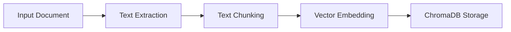
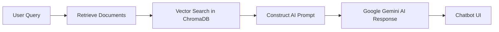

# Document Processing & AI Chatbot Service

A powerful Python service that processes documents (PDF, DOCX, TXT, HTML) and makes them searchable and interactive using AI-powered vector embeddings. Built with ChromaDB for efficient vector storage and retrieval, and Google Gemini AI for intelligent response generation.

Now includes a simple chatbot UI to interact with the AI system directly in the browser.

## 🚀 Features & Benefits

### 📖 AI-Powered Document Search
- Converts documents into vector embeddings for deep search.
- Stores and retrieves context-aware information using ChromaDB.
- Supports PDF, DOCX, TXT, HTML, and more.

### 🤖 AI Chatbot (New)
- Interactive Chatbot UI – Ask AI about stored business data.
- Customer-Specific Responses – Query business info, customers, and products.
- Strict & Comprehensive Search – Get exact document matches or AI-enhanced responses.
- CORS-enabled API – Works seamlessly with frontend and Postman.

## 🔹 How It Works

### 1️⃣ Document Processing & Storage

- Extracts text from PDFs, DOCX, TXT, and HTML.
- Splits text into manageable chunks.
- Embeds text using Google Gemini AI.
- Stores vectors in ChromaDB for fast retrieval.

### 2️⃣ AI Chatbot Interaction

- Accepts customer-specific queries.
- Searches stored knowledge for relevant data.
- Uses Google Gemini AI to generate responses.

## ⚡ Quick Start Guide

### 1️⃣ Clone & Setup
```sh
# Clone the repository
git clone https://github.com/arashghezavati/Document-Vectorization-Service.git
cd Document-Vectorization-Service

# Create a virtual environment
python -m venv venv
source venv/bin/activate  # Linux/Mac
.\venv\Scripts\activate   # Windows

# Install dependencies
pip install -r python-services/requirements.txt
```

### 2️⃣ Configure API Keys
Create a `.env` file in the root directory with the following content:
```
GOOGLE_GEMINI_API_KEY=your_api_key_here
GEMINI_MODEL=gemini-2.0-flash
CHROMA_DB_DIR=vector-database/store
```

### 3️⃣ Process Documents
Process text documents and store them in ChromaDB:
```sh
# Navigate to the python-services directory
cd python-services

# Process documents with a customer ID (e.g., customer_123)
python process_document.py ../docs/business_info.txt customer_123
python process_document.py ../docs/product_catalog.txt customer_123
python process_document.py ../docs/customer_list.txt customer_123
```

### 4️⃣ Start the AI Chatbot API
Run the FastAPI backend to enable chatbot functionality:
```sh
# Make sure you're in the python-services directory
cd python-services

# Start the API server
python -m uvicorn chatbot_api:app --reload --host 0.0.0.0 --port 8000
```

- Backend URL: http://localhost:8000
- API Docs: http://localhost:8000/docs

### 5️⃣ Open the Chatbot UI
- Open `python-services/index.html` in your browser.
- Enter a customer ID (default: customer_123).
- Type a query (e.g., "Tell me about our recent product").
- Click Send to interact with the AI-powered chatbot.

## 🔹 Examples of Chatbot Queries

| User Query | AI Response Example |
|------------|---------------------|
| "Explain our business to new customers in an email" | Subject: EcoTech Solutions - Sustainable Energy 🌱 |
| "Send an email to all customers about our latest product" | Product Update: Introducing SolarX 2.0 ☀️ |
| "What is the email of Lisa?" | Lisa Carter: lisa.carter@example.com 📧 |

## 📂 Project Structure
```
.
├── docs/                    # Sample business-related documents
├── python-services/
│   ├── chatbot_api.py       # FastAPI chatbot API
│   ├── process_document.py  # Processes & stores documents
│   ├── query_documents.py   # AI-powered document search
│   ├── chunking.py          # Splits text into chunks
│   ├── embedding_function.py # AI vector embedding
│   ├── extraction.py        # Extracts text from files
│   ├── requirements.txt     # Python dependencies
│   ├── index.html           # Chatbot UI frontend
├── .env                     # API keys & config (in root directory)
├── vector-database/         # ChromaDB storage
```

## 🔧 Requirements
- Python 3.9+
- ChromaDB (pip install chromadb)
- Google Gemini API Key
- FastAPI & Uvicorn (pip install fastapi uvicorn)

## 🔄 Contributing
- ✅ Fork the repository
- ✅ Create a feature branch
- ✅ Commit your changes
- ✅ Push & open a Pull Request

## 📩 Support
Open an issue if you:
- Encounter a bug 🐞
- Want a new feature 🚀
- Need help using the chatbot 🤖

## 📜 License
MIT License – Feel free to use and modify! 🎉

## 🎯 What's New?
- ✅ Chatbot UI for direct interaction (no Postman needed).
- ✅ CORS-enabled API to support web frontends.
- ✅ Improved AI responses using Google Gemini.
- ✅ Three structured documents to simulate real-world business cases.

## 🔍 Troubleshooting
- If you encounter issues with the virtual environment, try creating a new one:
  ```sh
  python -m venv venv_new
  .\venv_new\Scripts\activate  # Windows
  source venv_new/bin/activate  # Linux/Mac
  pip install -r python-services/requirements.txt
  ```
- Make sure your `.env` file is in the root directory of the project.
- Check that the Google Gemini API key is valid and has sufficient quota.