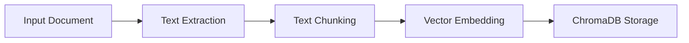
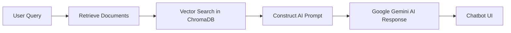
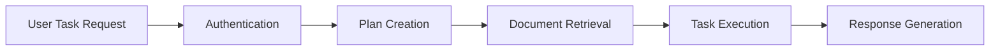

# Document Processing & AI Chatbot Service

A powerful Python service that processes documents (PDF, DOCX, TXT, HTML) and makes them searchable and interactive using AI-powered vector embeddings. Built with ChromaDB for efficient vector storage and retrieval, and Google Gemini AI for intelligent response generation.

Features a simplified UI for document management and an AI agent system powered by LangGraph for complex document processing tasks.

## 🚀 Features & Benefits

### 📖 AI-Powered Document Search
- Converts documents into vector embeddings for deep search.
- Stores and retrieves context-aware information using ChromaDB.
- Supports PDF, DOCX, TXT, HTML, and more.

### 🤖 AI Chatbot
- Interactive Chatbot UI – Ask AI about stored business data.
- Customer-Specific Responses – Query business info, customers, and products.
- CORS-enabled API – Works seamlessly with frontend and Postman.

### 📤 Document & Folder Management
- Upload documents directly through the simplified UI.
- Create folders to organize documents.
- Name documents with custom titles during upload.
- Assign documents to specific folders.
- Delete documents and folders as needed.
- View all documents regardless of folder in the chat interface.

### 🧠 AI Agent with LangGraph
- Task-based AI agent for complex document operations.
- Dynamic workflow planning and execution using LangGraph.
- Natural language task requests (e.g., "Summarize my documents about AI agents").
- User-specific document access with proper authentication.
- Document context integration for informed responses.

## 🔹 How It Works

### 1️⃣ Document Processing & Storage

- Extracts text from PDFs, DOCX, TXT, and HTML.
- Splits text into manageable chunks.
- Embeds text using Google Gemini AI.
- Stores vectors in ChromaDB for fast retrieval.

### 2️⃣ AI Chatbot Interaction

- Accepts customer-specific queries or queries across all document categories.
- Searches stored knowledge for relevant data.
- Uses Google Gemini AI to generate responses.

### 3️⃣ AI Agent Workflow

- Processes natural language task requests.
- Creates a plan for completing the task.
- Retrieves relevant documents from the user's collection.
- Executes the task using document context.
- Generates a comprehensive response.

## ⚡ Quick Start Guide

### 1️⃣ Clone & Setup
```sh
# Clone the repository
git clone https://github.com/arashghezavati/Document-Vectorization-Service.git
cd Document-Vectorization-Service

# Create a virtual environment
python -m venv venv
source venv/bin/activate  # Linux/Mac
.\venv\Scripts\activate   # Windows

# Install dependencies
pip install -r python-services/requirements.txt
```

### 2️⃣ Configure API Keys
Create a `.env` file in the root directory with the following content:
```
GOOGLE_GEMINI_API_KEY=your_api_key_here
GEMINI_MODEL=gemini-2.0-flash
JWT_SECRET_KEY=your_jwt_secret_key
EMBEDDING_DIMENSION=768
EMBEDDING_MODEL=text-embedding-004
```

### 3️⃣ Start the AI Chatbot API
Run the FastAPI backend to enable chatbot functionality:
```sh
# Make sure you're in the python-services directory
cd python-services

# Start the API server
python run_server.py
```

- Backend URL: http://localhost:8000
- API Docs: http://localhost:8000/docs

### 4️⃣ Open the Application UI
- Open `http://localhost:3000` in your browser.
- Register or log in to your account.
- Navigate through the simplified interface:
  - **Dashboard**: Overview of your documents and folders.
  - **Documents**: Create folders and upload documents.
  - **Chat**: Interact with the AI chatbot about your documents.
  - **Tasks**: Submit complex tasks to the AI agent.

### 5️⃣ Working with Documents
- Create folders to organize your documents.
- Upload documents with custom names and assign them to folders.
- All documents will be available in the chat interface regardless of folder.
- Use the document filter in chat to focus on specific documents.

### 6️⃣ Using the AI Agent
- Navigate to the Tasks tab.
- Enter a natural language task request (e.g., "Summarize my documents about AI agents").
- The agent will process your request, retrieve relevant documents, and generate a response.

## 🔧 Technical Stack

- **Backend**: FastAPI, ChromaDB, LangGraph
- **AI**: Google Gemini API
- **Frontend**: React.js
- **Authentication**: JWT-based authentication
- **Database**: ChromaDB for vector storage
- **Document Processing**: PyPDF2, python-docx, BeautifulSoup

## 🤝 Contributing

Contributions are welcome! Please feel free to submit a Pull Request.

1. Fork the repository
2. Create your feature branch (`git checkout -b feature/amazing-feature`)
3. Commit your changes (`git commit -m 'Add some amazing feature'`)
4. Push to the branch (`git push origin feature/amazing-feature`)
5. Open a Pull Request

## 📩 Support

For support, please open an issue in the GitHub repository or contact the maintainers directly.